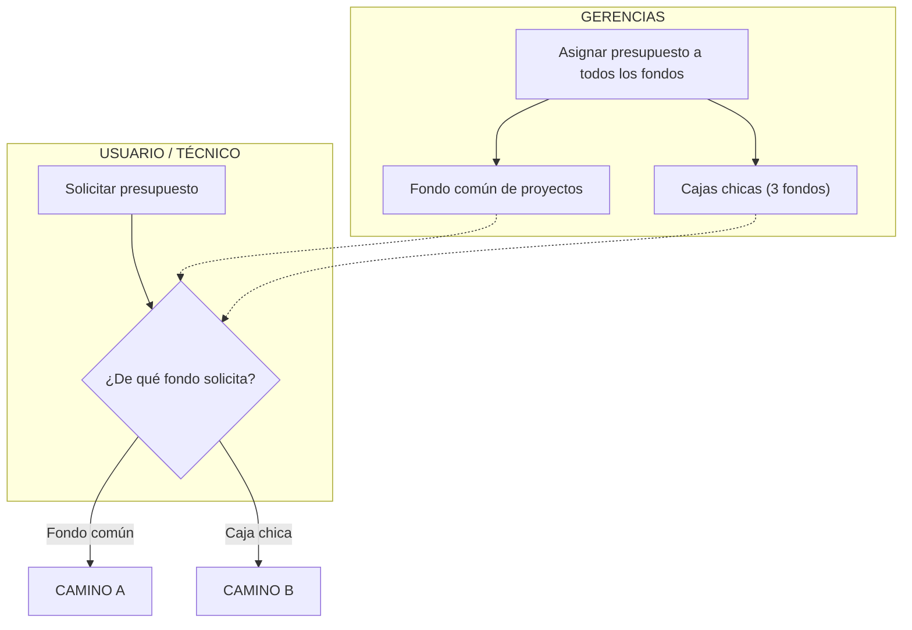
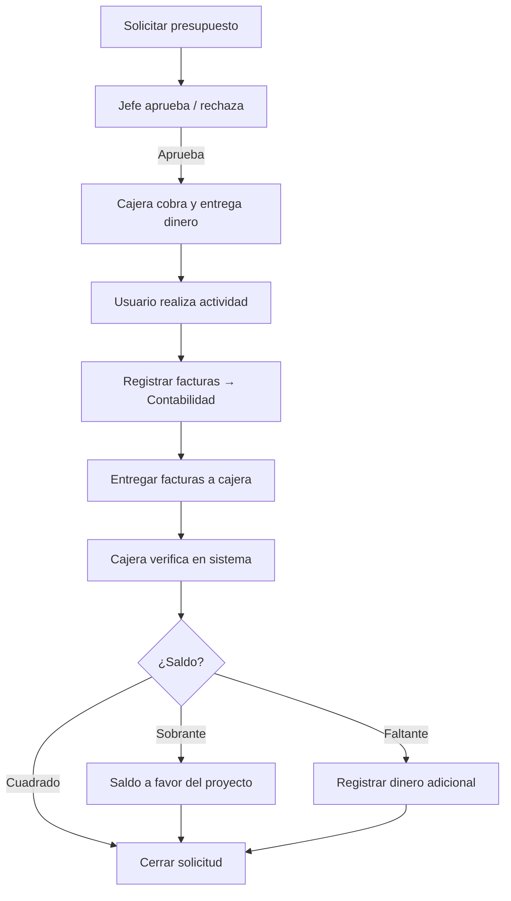
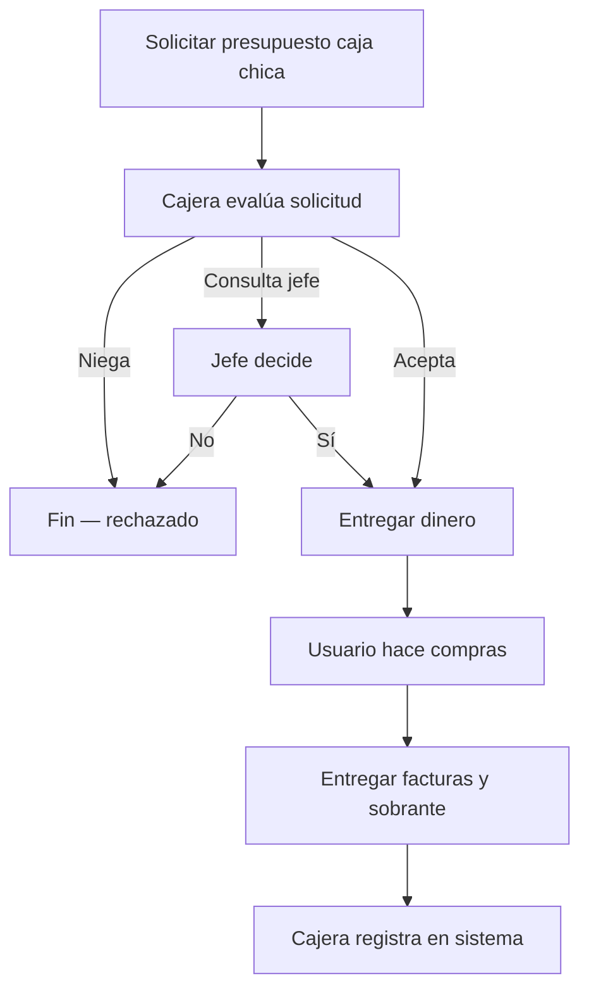

# Flujograma: gestión de presupuesto y fondos

Proceso completo con los dos caminos: **fondo común de proyectos** y **caja chica**.

> Para ver el diagrama renderizado, abrir `flujograma-presupuesto.html` en el navegador.

---

## 1. Asignación inicial y bifurcación

---

## 2. Camino A — Fondo común de proyectos

| Paso | Rol | Acción |
|------|-----|--------|
| 1 | Usuario | Solicita presupuesto del fondo común |
| 2 | Jefe inmediato | Aprueba o rechaza según fondos del cliente |
| 3 | Cajera | Cobra presupuesto y entrega dinero (efectivo o transferencia) |
| 4 | Usuario | Realiza viaje/actividad y registra facturas en el sistema |
| 5 | Contabilidad | Recibe resumen de facturas |
| 6 | Usuario | Entrega facturas físicas a la cajera |
| 7 | Cajera | Verifica facturas con el sistema |
| 8 | Cajera | Ajusta saldo: sobrante a favor del proyecto o registra faltante |
| 9 | Contabilidad | Cierra la solicitud |

---

## 3. Camino B — Caja chica

| Paso | Rol | Acción |
|------|-----|--------|
| 1 | Usuario | Solicita presupuesto de una de las 3 cajas chicas |
| 2 | Cajera | Pregunta para qué es y de qué caja pide |
| 3 | Cajera | Acepta, niega o consulta con su jefe inmediato |
| 4 | Cajera | Entrega dinero de la caja chica |
| 5 | Usuario | Realiza las compras |
| 6 | Usuario | Entrega facturas y sobrante a la cajera |
| 7 | Cajera | Registra todo en el sistema |

---

## Roles involucrados

| Rol | Camino A (Fondo común) | Camino B (Caja chica) |
|-----|------------------------|------------------------|
| Gerencias | Asignan presupuesto a fondos | Asignan presupuesto a fondos |
| Usuario / Técnico | Solicita, registra y entrega facturas | Solicita, compra y entrega facturas |
| Jefe inmediato | Aprueba solicitud del usuario | — |
| Cajera | Cobra, verifica y liquida | Evalúa, entrega dinero y registra |
| Jefe de cajera | — | Aprueba si la cajera consulta |
| Contabilidad | Recibe resumen y cierra solicitud | — |
