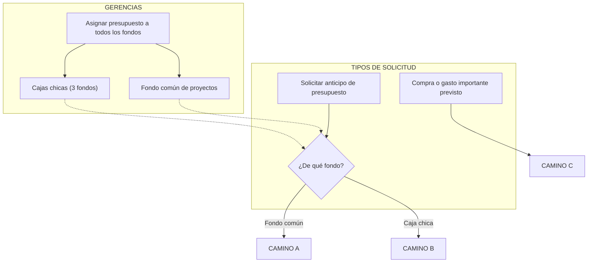
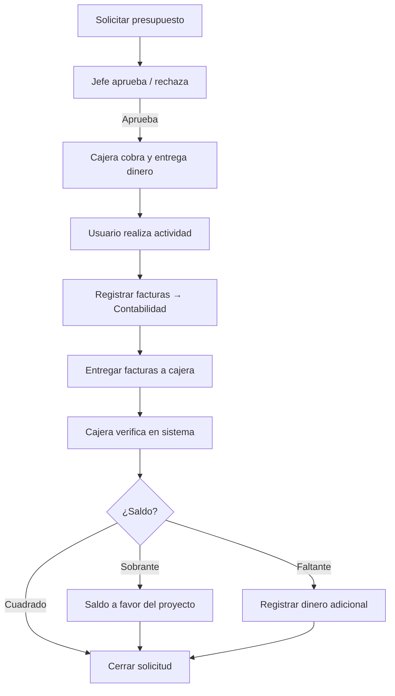
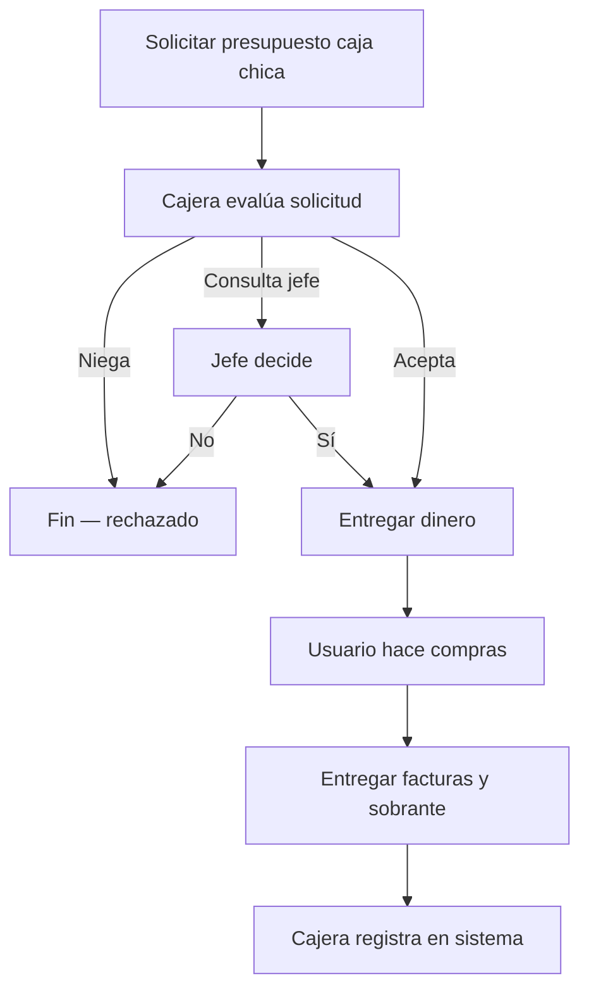
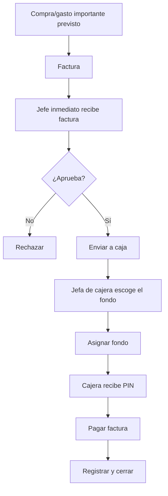

# Flujograma: gestión de presupuesto y fondos

Proceso completo con tres caminos: **fondo común de proyectos**, **caja chica** y **compra/gasto importante previsto**.

> Para ver el diagrama renderizado, abrir `flujograma-presupuesto.html` en el navegador.
> Imagen lista para enviar: `flujograma-presupuesto.png` · PDF: `flujograma-presupuesto.pdf`

---

## 1. Asignación inicial y bifurcación

---

## 2. Camino A — Fondo común de proyectos

| Paso | Rol | Acción |
|------|-----|--------|
| 1 | Usuario | Solicita presupuesto del fondo común |
| 2 | Jefe inmediato | Aprueba o rechaza según fondos del cliente |
| 3 | Cajera | Cobra presupuesto y entrega dinero (efectivo o transferencia) |
| 4 | Usuario | Realiza viaje/actividad y registra facturas en el sistema |
| 5 | Contabilidad | Recibe resumen de facturas |
| 6 | Usuario | Entrega facturas físicas a la cajera |
| 7 | Cajera | Verifica facturas con el sistema |
| 8 | Cajera | Ajusta saldo: sobrante a favor del proyecto o registra faltante |
| 9 | Contabilidad | Cierra la solicitud |

---

## 3. Camino B — Caja chica

| Paso | Rol | Acción |
|------|-----|--------|
| 1 | Usuario | Solicita presupuesto de una de las 3 cajas chicas |
| 2 | Cajera | Pregunta para qué es y de qué caja pide |
| 3 | Cajera | Acepta, niega o consulta con su jefe inmediato |
| 4 | Cajera | Entrega dinero de la caja chica |
| 5 | Usuario | Realiza las compras |
| 6 | Usuario | Entrega facturas y sobrante a la cajera |
| 7 | Cajera | Registra todo en el sistema |

---

## 4. Camino C — Compra o gasto importante previsto

Nace de una compra o gasto importante **ya previsto**. No se pide anticipo: se parte de la **factura**.

| Paso | Rol | Acción |
|------|-----|--------|
| 1 | Usuario | Tiene compra/gasto importante previsto y obtiene la factura |
| 2 | Jefe inmediato | Recibe la factura y aprueba o rechaza el gasto |
| 3 | Caja | Recibe el gasto aprobado |
| 4 | Jefa inmediata de cajera | Escoge de qué fondo debe cubrirse el gasto |
| 5 | Cajera | Recibe el PIN y realiza el pago |
| 6 | Cajera | Registra el pago y cierra |

---

## Roles involucrados

| Rol | Camino A | Camino B | Camino C |
|-----|----------|----------|----------|
| Gerencias | Asignan presupuesto | Asignan presupuesto | Fondos disponibles para cubrir |
| Usuario / Técnico | Solicita anticipo y factura al final | Solicita anticipo y factura al final | Inicia con factura del gasto |
| Jefe inmediato | Aprueba solicitud | — | Aprueba el gasto/factura |
| Cajera | Cobra, verifica y liquida | Evalúa, entrega dinero y registra | Recibe PIN y paga |
| Jefa / Jefe de cajera | — | Aprueba si la cajera consulta | Escoge el fondo que cubre el gasto |
| Contabilidad | Recibe resumen y cierra | — | — |
